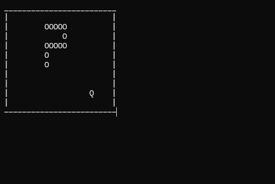

# Snake Game (C++)

A simple console snake game, written in C++ using ncurses.

## Controls

- ↑ / ← / ↓ / → — movement

## Features

- Snake movement on the field
- Growth when eating food
- Score counting
- Collision detection (walls and self)
- Rendering with ncurses

## Getting Started

Requires Linux/macOS (or WSL on Windows) with the `ncurses` library installed.

```bash
# Install ncurses (Ubuntu/Debian)
sudo apt install libncurses5-dev

# Build and run
g++ main.cpp -o snake -lncurses
./snake
```

## Скриншот


## Author

[Welgy](https://github.com/Welgy)
